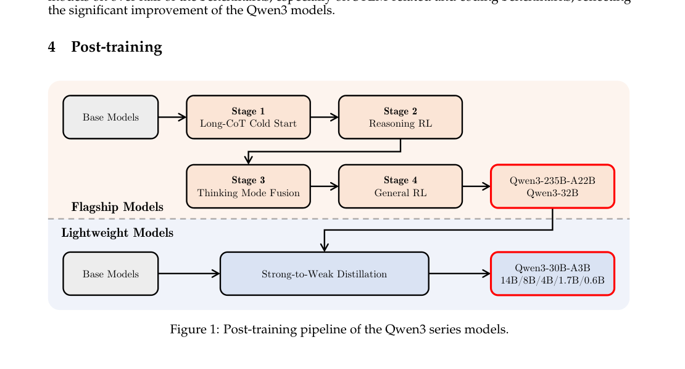
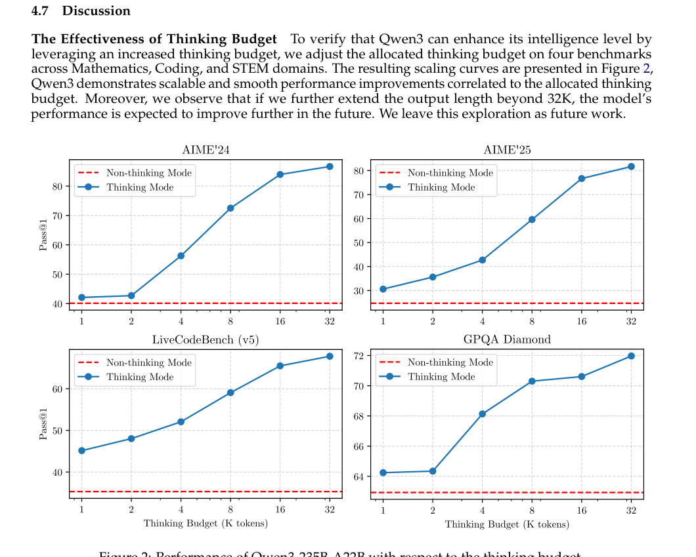

# Quick View

**Title**: Qwen3 Technical Report
**Authors**: Qwen Team (An Yang, Anfeng Li, Baosong Yang, et al. - 61 authors)
**arXiv**: [2505.09388](https://arxiv.org/abs/2505.09388)
**Year**: 2025

# Question

How to build a unified large language model that supports both rapid responses and deep reasoning, while efficiently transferring knowledge from flagship models to lightweight models?

# Task

This paper develops the Qwen3 series of large language models:
1. Dense and MoE architectures spanning 0.6B to 235B parameters
2. Unified "thinking mode" (complex reasoning) and "non-thinking mode" (rapid response) in a single model
3. Multilingual support for 119 languages and dialects
4. Efficient lightweight model construction through knowledge distillation

# Challenge

1. **Mode Switching Dilemma**: Existing approaches require switching between chat-optimized models (e.g., GPT-4o) and dedicated reasoning models (e.g., QwQ-32B), increasing deployment complexity
2. **Inference Resource Allocation**: Difficulty in dynamically allocating computational resources based on task complexity - simple tasks waste compute while complex tasks lack resources
3. **Small Model Training Cost**: Training small-scale models from scratch requires substantial computational resources, while direct distillation often suffers severe performance loss
4. **Multilingual Expansion**: Maintaining performance on major languages while expanding to more languages is challenging

# Insight

Fuse reasoning capabilities and rapid response abilities into a single model through a four-stage post-training pipeline, and leverage flagship model knowledge to efficiently train lightweight models via Strong-to-Weak Distillation.

*Figure 1: Post-training pipeline of Qwen3. Flagship models undergo 4-stage training; lightweight models are trained via Strong-to-Weak Distillation*

# Contribution

## 1. **Thinking Mode Fusion**

- **Approach**: Conduct continual SFT on the Reasoning RL model using a mixed dataset containing both "thinking" and "non-thinking" data. Control mode switching via `/think` and `/no_think` flags in chat templates
- **Technical Advantage**:
  - Eliminates the need to deploy multiple models
  - Supports dynamic mode switching based on user queries or chat templates
  - Model naturally learns to handle intermediate states (foundation for thinking budget mechanism)

## 2. **Thinking Budget Mechanism**

- **Approach**: When model thinking length reaches a user-defined threshold, manually insert a stop-thinking instruction; the model generates final response based on accumulated reasoning
- **Technical Advantage**:
  - Allows users to adaptively allocate computational resources based on task complexity
  - Achieves balance between latency and performance
  - Emerges naturally from Thinking Mode Fusion without explicit training

*Figure 2: Performance of Qwen3-235B-A22B with respect to thinking budget. Performance scales smoothly with increased budget*

## 3. **Strong-to-Weak Distillation**

- **Approach**: Two-phase process: (1) Off-policy distillation - use flagship model outputs as training data; (2) On-policy distillation - student model samples, teacher model provides online scores
- **Technical Advantage**:
  - Significantly reduces computational resources needed to train small models (only 1/10 of RL GPU hours)
  - Distillation enables student model to expand exploration space and enhance reasoning potential
  - Lightweight models achieve or exceed performance of larger previous-generation models

## 4. **Four-Stage Post-Training Pipeline**

- **Stage 1 (Long-CoT Cold Start)**: SFT with diverse long CoT data to establish reasoning foundations
- **Stage 2 (Reasoning RL)**: Reinforcement learning on math, code, and general reasoning tasks
- **Stage 3 (Thinking Mode Fusion)**: Fuse thinking and non-thinking capabilities
- **Stage 4 (General RL)**: Further strengthen general capabilities and agent abilities

## 5. **Large-Scale Multilingual Pre-training**

- **Approach**: Pre-train on 36 trillion tokens covering 119 languages and dialects (4x expansion from Qwen2.5's 29 languages)
- **Technical Advantage**: Architectural improvements including GQA, QK-Norm, and RMSNorm ensure stable training with 128K context length support

# Experiments

## Core Contribution Impact (Ablation Studies)

### Thinking vs Non-Thinking Mode Comparison

| Task Category | Qwen3-235B-A22B (Thinking) | Qwen3-235B-A22B (Non-thinking) |
|--------------|---------------------------|-------------------------------|
| AIME'24 | 85.7 | 81.4 |
| AIME'25 | 81.5 | 72.9 |
| LiveCodeBench v5 | 70.7 | 65.7 |
| CodeForces | 2056 / 98.2% | 1977 / 97.7% |

Thinking mode significantly outperforms Non-thinking mode on complex reasoning tasks like mathematics and programming.

### Distillation vs Reinforcement Learning Efficiency

| Method | AIME'24 | AIME'25 | MATH500 | GPU Hours |
|--------|---------|---------|---------|-----------|
| Off-policy Distillation | 74.4 (93.3) | 65.5 (86.7) | 97.0 | 1,800 |
| + Reinforcement Learning | 67.6 (90.0) | 55.5 (83.3) | 94.8 | 17,920 |
| + On-policy Distillation | **74.4 (93.3)** | **65.5 (86.7)** | **97.0** | **1,800** |

On-policy distillation achieves comparable or better performance than RL while requiring only ~1/10 of the computational resources.

### Model Scale Comparison

- **Qwen3-235B-A22B** (MoE, 22B activated params): Achieves SOTA on most benchmarks, competitive with GPT-4o, DeepSeek-V3
- **Qwen3-32B** (Dense): Surpasses Qwen2.5-72B and Llama-4-Scout (109B params) using only 32B parameters
- **Qwen3-30B-A3B** (MoE): With only 3B activated parameters, achieves performance comparable to Qwen3-14B

## Limitation

1. **Thinking Mode Performance Degradation on Long Context**: On long-context retrieval tasks like RULER benchmark, thinking mode performance slightly degrades. Hypothesized that the thinking process may interfere with retrieval
2. **Thinking Mode Fusion Trade-off on Complex Tasks**: For challenging tasks like AIME'24 and LiveCodeBench, performance in thinking mode actually decreases after Thinking Mode Fusion and General RL training stages
3. **Multilingual Coverage**: Despite supporting 119 languages, there is room for improvement on low-resource languages
