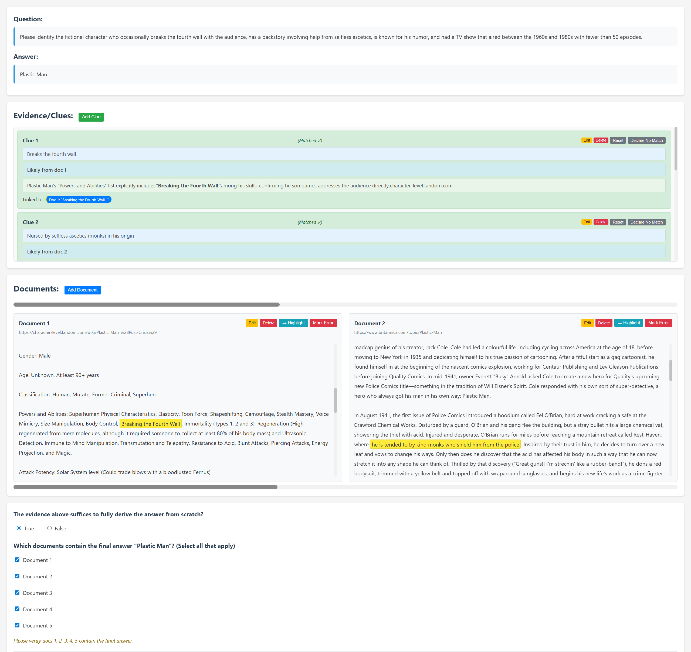
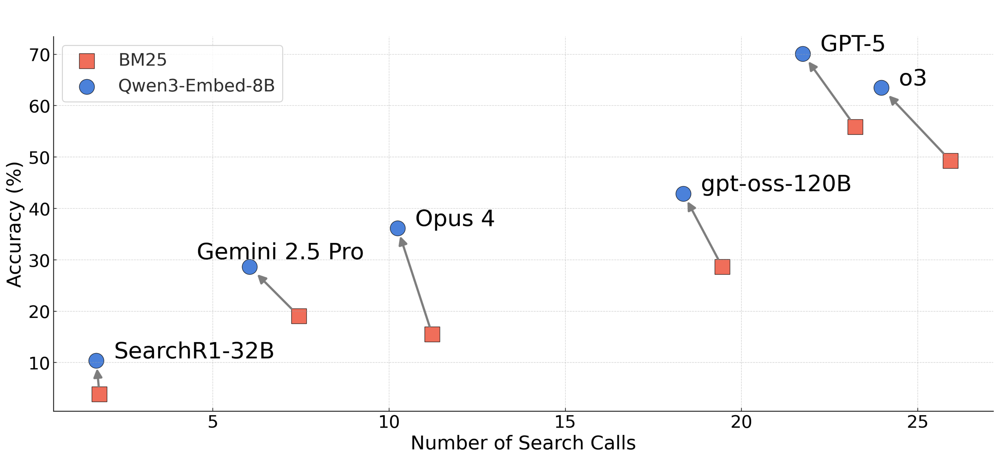
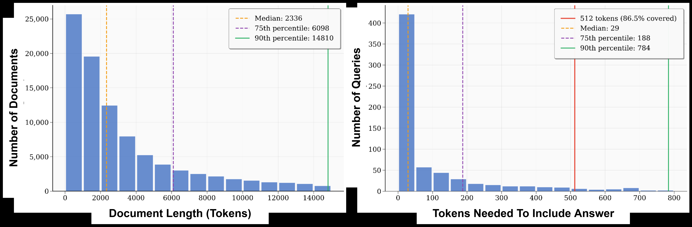

# Quick View

**Title**: BrowseComp-Plus: A More Fair and Transparent Evaluation Benchmark of Deep-Research Agent
**Authors**: Zijian Chen, Xueguang Ma, Shengyao Zhuang, Ping Nie, Kai Zou, Andrew Liu, Joshua Green, Kshama Patel, Ruoxi Meng, Mingyi Su, et al. (20 authors total)
**arXiv**: [2508.06600](https://arxiv.org/abs/2508.06600)
**Year**: 2025
**Institutions**: University of Waterloo, CSIRO, Carnegie Mellon University, University of Queensland

# Question

How can we fairly, transparently, and reproducibly evaluate the capabilities of Deep-Research Agents while independently analyzing the contributions of retriever and LLM reasoning components?

# Task

Construct a benchmark dataset for evaluating Deep-Research Agents that:
1. Provides a fixed, human-verified document corpus
2. Supports independent evaluation of retriever and LLM components
3. Eliminates dependency on dynamic web search APIs
4. Contains positive documents and challenging hard negatives

# Challenge

1. **Fairness Issue**: Existing evaluations (e.g., BrowseComp) rely on black-box web search APIs. API results change dynamically and lack transparency, making fair comparisons between systems impossible and experiments difficult to reproduce.

2. **Transparency Issue**: Lack of control over the document corpus prevents isolating the retriever's contribution to final performance.

3. **Accessibility Issue**: Commercial web search APIs are expensive, and retrieval quality varies.

4. **Corpus Construction Difficulty**: Must simultaneously satisfy three competing requirements: complete evidence coverage, moderate retrieval difficulty, and practical corpus size.

# Insight

By constructing a fixed, human-verified document corpus (containing supporting documents and mined hard negatives), end-to-end evaluation of Deep-Research systems can be transformed into controllable component-level analysis, enabling fair, transparent, and reproducible evaluation.

# Contribution

1. **BrowseComp-Plus Benchmark Dataset**
   - **Approach**: Starting from BrowseComp's 1,266 QA pairs, used OpenAI o3 model to automatically mine evidence documents, followed by human annotation verification. Final result: 830 queries, 100,195 documents. Each query averages 6.1 evidence documents, 76.28 hard negatives, and 2.9 gold documents.
   - **Technical Advantage**: Fixed corpus enables fair comparison between systems; human verification ensures document quality; hard negatives increase retrieval difficulty.

2. **Two-Stage Evidence Document Collection Pipeline**
   - **Approach**: Stage 1 uses o3 model to search for webpages supporting the answer and extract clue-URL-evidence triples. Stage 2 involves human annotators verifying document support for each clue and marking gold documents containing the final answer.
   - **Technical Advantage**: Combines automation with human verification for both efficiency and reliability; 14 annotators invested 400+ hours.

*Figure: Human annotation interface where annotators verify document support for each clue and mark gold documents containing the final answer.*

3. **Hard Negative Mining Method**
   - **Approach**: Used GPT-4o to decompose complex questions into an average of 7 sub-queries. Each sub-query retrieves up to 100 search results via Google Search API. These pages are crawled and processed as hard negatives.
   - **Technical Advantage**: Keeps corpus size manageable (~100K documents) while ensuring the retrieval task remains challenging.

4. **Systematic Retriever-Agent Interaction Analysis**
   - **Approach**: Evaluated combinations of multiple retrievers (BM25, Qwen3-Embedding, ReasonIR) with multiple LLMs (GPT-5, o3, Opus 4, open-source models) under controlled conditions.
   - **Technical Advantage**: First study to quantify the impact of retrieval quality on Deep-Research systems.

# Experiments

## Core Contribution Impact (Ablation Studies)

### Retriever Impact on End-to-End Accuracy

*Figure: Accuracy vs. Number of Search Calls for different LLMs using BM25 (red squares) vs. Qwen3-Embed-8B (blue circles) retrievers. Stronger retrievers (blue) consistently improve accuracy across all models.*

| LLM | BM25 Accuracy | Qwen3-Embed-8B Accuracy | Improvement |
|-----|---------------|------------------------|-------------|
| GPT-5 | 55.9% | 70.12% | +14.2% |
| o3 | 49.28% | 63.49% | +14.2% |
| Sonnet 4 | 14.34% | 36.75% | +22.4% |
| Opus 4 | 15.54% | 36.14% | +20.6% |

**Key Findings**:
- Stronger retrievers not only improve accuracy but also **reduce search calls** (GPT-5: from 23.23 to 21.74 calls)
- Open-source models (Qwen3-32B, SearchR1-32B) significantly lag behind closed-source models in tool-use capability
- With Oracle retrieval (directly providing correct documents), gpt-4.1 achieves 93.49% accuracy, proving retrieval is the main bottleneck

### Impact of Reasoning Intensity (gpt-oss series)

| Model | Reasoning Intensity | Accuracy | Search Calls |
|-------|-------------------|----------|--------------|
| oss-20B | low | 13.37% | 1.87 |
| oss-20B | high | 34.58% | 23.87 |
| oss-120B | low | 24.94% | 2.21 |
| oss-120B | high | 42.89% | 18.35 |

### Impact of Corpus Scale

Expanding corpus from 100K to ~10M documents (adding Fineweb-edu):
- BM25 retrieval slightly improves (more accurate IDF estimation)
- Neural retriever performance degrades (new documents unlabeled, treated as negatives)
- **Conclusion**: 100K corpus is sufficient for effective evaluation

## Limitation

*Figure: Left shows document length distribution (median 2336 tokens). Right shows tokens needed to include the answer. 512 token truncation covers 86.5% of query answers.*

1. **Insufficient Tool-Use Capability in Open-Source Models**: Qwen3-32B and SearchR1-32B average fewer than 2 search calls, far below closed-source models' 20+ calls

2. **Document Truncation**: Due to cost constraints, only the first 512 tokens of each document are provided (86.5% of queries still have answer coverage)

3. **Google Maps Queries Excluded**: 42 queries requiring Google Maps API were removed

4. **Static Corpus Snapshot**: Cannot reflect dynamic webpage updates
