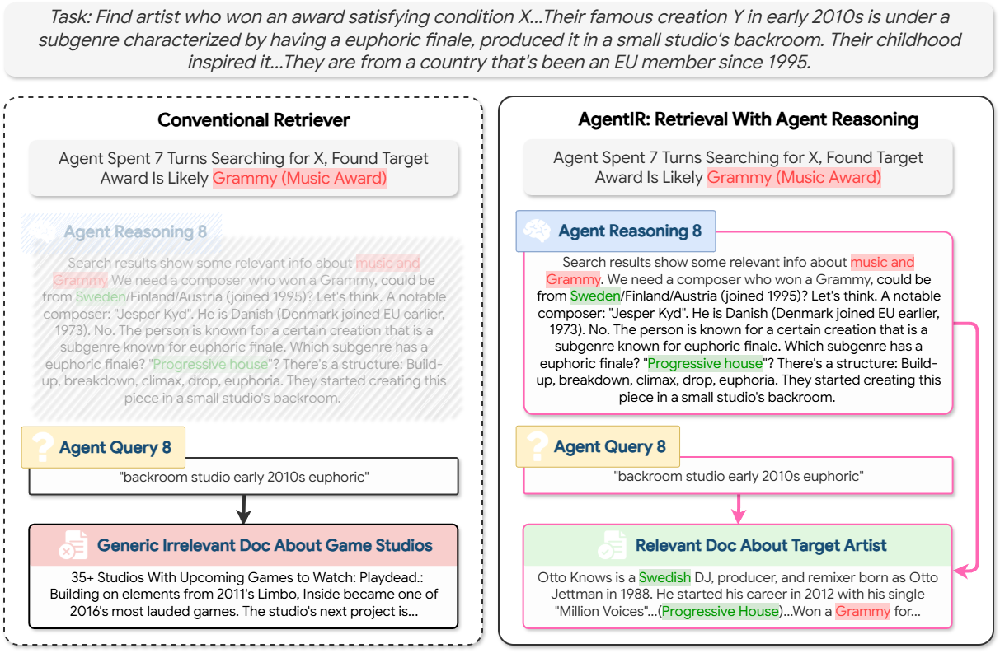
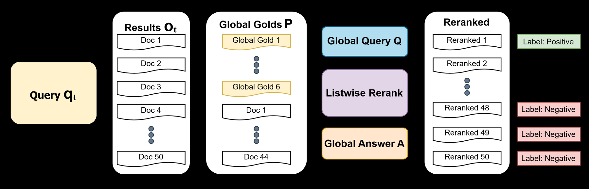
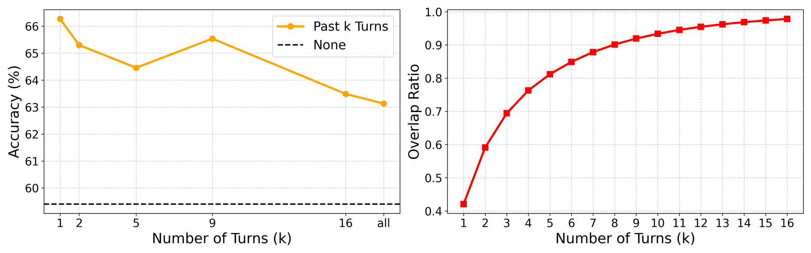
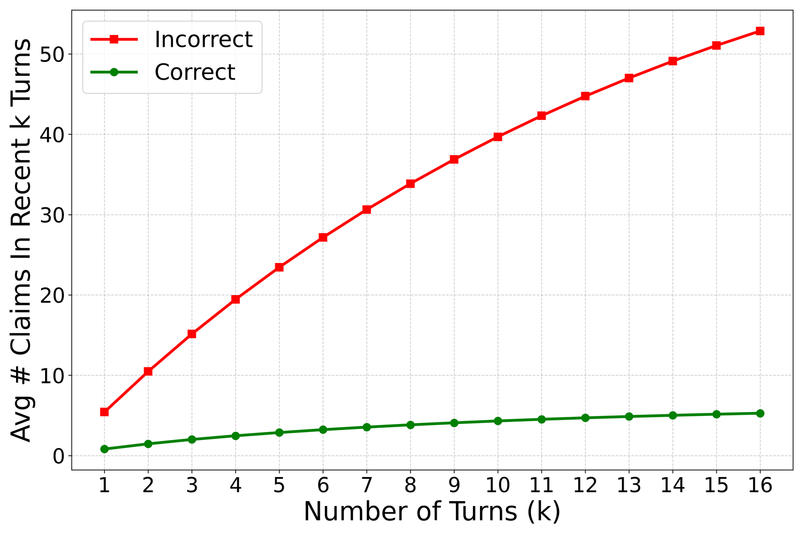

# Quick View

**Title**: AgentIR: Reasoning-Aware Retrieval for Deep Research Agents
**Authors**: Zijian Chen, Xueguang Ma, Shengyao Zhuang, Jimmy Lin, Akari Asai, Victor Zhong
**arXiv**: [2603.04384](https://arxiv.org/abs/2603.04384)
**Year**: 2026

# Question

Deep Research agents generate explicit reasoning traces before each search call, encoding rich intent and contextual signals — yet no existing retriever learns to exploit them. How can retrieval systems leverage these "free" reasoning signals to improve search quality for agentic multi-turn retrieval?

# Task

Build a specialized retriever for Deep Research agents that jointly encodes the agent's reasoning trace alongside its query, improving end-to-end accuracy on complex multi-hop information-seeking tasks (BrowseComp-Plus benchmark requiring 20+ search turns).

# Challenge

1. **Query ambiguity**: Agent-issued sub-queries (e.g., "backroom studio early 2010s euphoric") are highly ambiguous in isolation — conventional retrievers operating on the query alone misinterpret intent
2. **Lost multi-turn context**: Traditional retrieval treats each agent query as an independent human search, discarding all accumulated context from prior search turns
3. **No training data**: No retriever training data exists for agent-issued sub-queries in multi-turn Deep Research — existing QA datasets provide only global question-answer pairs, not turn-level relevance supervision

# Insight

The agent's reasoning trace is a "free", implicitly curated retrieval signal: it encodes task intent, reflection on prior results, and hypothetical search targets, while naturally filtering out outdated incorrect hypotheses — making it a cleaner signal than naively embedding the full interaction history.

*Figure 1: Reasoning-Aware Retrieval (AgentIR-4B) vs. conventional retrieval. Left: conventional retriever returns irrelevant results from the ambiguous query alone. Right: AgentIR jointly encodes the reasoning trace, leveraging intent clarification, reflection on prior results, and hypothetical search targets to retrieve the correct document.*

# Contribution

1. **Reasoning-Aware Retrieval (New Retrieval Paradigm)**
   - **Approach**: Concatenate the agent's current reasoning trace τ_t with query q_t and jointly encode them as retrieval input (o_t ← R(τ_t, q_t)), using a template "Reasoning: {reasoning} Query: {query}"
   - **Technical Advantage**: The reasoning trace provides three types of signal: (1) **Task intent** — disambiguates the query like an implicit instruction (analogous to task-aware retrieval but without human annotation); (2) **Reflection on prior results** — summarizes confirmed findings from earlier turns; (3) **Hypothetical search targets** — similar to HyDE but grounded in the full interaction history, not just parametric knowledge. Critically, these signals come "for free" — the agent generates reasoning traces as part of its standard operating loop, requiring no additional LLM calls

2. **DR-Synth (Training Data Synthesis Pipeline)**
   - **Approach**: Transform standard QA datasets' (Q, A, P) triples into sub-query-level training data: (1) Run agent rollouts with a conventional retriever on Q to generate multi-turn sub-queries (τ_t, q_t); (2) At each turn, apply oracle reranking — inject ground-truth positive documents P into the candidate pool, then use an LLM for listwise reranking (considering both sub-query relevance and global question alignment); (3) Label top-1 as positive, bottom-7 as hard negatives; (4) Apply rejection sampling, keeping only trajectories that correctly answered Q
   - **Technical Advantage**: Solves the core bottleneck of missing sub-query-level training data for Deep Research; the oracle reranking mechanism ensures labels satisfy both local relevance and global consistency; generates 5,238 effective training instances from just 500 WebShaper questions

*Figure 2: Oracle reranking procedure in DR-Synth. For each sub-query, retrieve top-50 documents, inject global gold documents, use LLM listwise reranking (with global query Q and answer A), label top-1 as positive and bottom-7 as hard negatives.*

# Experiments

## Main Results

End-to-end evaluation on BrowseComp-Plus (Table 1):

| Agent | Retriever | Accuracy | Recall | Search Calls |
|-------|-----------|----------|--------|-------------|
| Tongyi-DR | BM25 | 33.98 | 46.83 | 32.92 |
| Tongyi-DR | Qwen3-Embed-4B | 48.67 | 59.90 | 31.02 |
| Tongyi-DR | Qwen3-Embed-8B | 50.72 | 61.78 | 30.43 |
| Tongyi-DR | ReasonIR-8B | 51.03 | 63.62 | 31.15 |
| Tongyi-DR | LLM Rerank | 55.66 | 68.35 | 28.85 |
| Tongyi-DR | **AgentIR-4B** | **66.27** | **78.86** | **25.91** |
| oss-120b-high | **AgentIR-4B** | **66.99** | **78.13** | **24.08** |
| GLM-4.7 | **AgentIR-4B** | **64.66** | **79.21** | **29.85** |

Key findings:
- AgentIR-4B achieves **+17.6%** absolute accuracy over the same backbone (Qwen3-Embed-4B)
- Outperforms Qwen3-Embed-8B (2x size) by **~15%** absolute
- Surpasses computationally expensive LLM Reranking by **~10%** with no reranking overhead
- Reduces search calls from 32.92 (BM25) to 25.91, demonstrating significant efficiency gains
- **Generalizes across agents** without additional fine-tuning (trained on Tongyi-DR rollouts, transfers to oss-120b-high and GLM-4.7)

## Core Contribution Impact (Ablation Studies)

**Component ablation (Table 2)**:

| Method | Tongyi-DR Acc | oss-120b Acc | GLM-4.7 Acc |
|--------|--------------|-------------|-------------|
| Qwen3-Embed-4B (baseline) | 48.67 | 47.59 | 50.48 |
| + Reasoning (no training) | 55.54 | 51.33 | 50.90 |
| + DR-Synth training (no reasoning) | 59.40 | 59.16 | 57.47 |
| + Both (AgentIR-4B) | **66.27** | **66.99** | **64.66** |

Both components are independently effective, and their combination yields the largest gains.

**Alternative signals ablation (Table 3)**: Using only the current reasoning trace (AgentIR-4B) consistently outperforms all alternatives — Global Question, Prior Queries, Prior Queries & Reasonings, and full trajectory with documents.

**History turns analysis**:

*Figure 3: (a) Accuracy vs. number of embedded history turns k — using only the current turn (k=1) achieves the best performance. (b) Clue overlap ratio — the current reasoning alone already covers >40% of all historical clues, confirming that the agent's current reasoning naturally summarizes prior findings.*

## Limitation

**"Forgetting as a Feature" Analysis**:

*Figure 4(b): Average number of correct vs. incorrect claims in the most recent k reasoning turns. Incorrect claims (red) grow linearly with more turns, while correct claims (green) remain nearly flat. This explains why adding more history is harmful — noise grows far faster than useful signal.*

The advantage of the current reasoning trace lies in its implicit curation of history: confirmed findings are summarized and retained, while incorrect hypotheses (e.g., "Jesper Kyd", "Finland") are naturally forgotten. Naively embedding the full history introduces substantial outdated noise — in the extreme case (Prior Queries & Reasonings & Docs), 11.45% of runs had zero recall, averaging 37.46 search turns vs. 27.18 overall.

Additional limitations not explored in the paper:
- Evaluated on a single benchmark (BrowseComp-Plus)
- Training relies on rollouts from a specific agent (Tongyi-DR), though generalization is strong
- Reasoning trace quality is inherently dependent on the agent's reasoning capability
