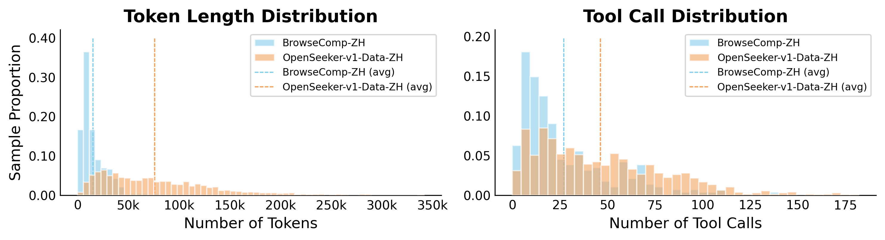
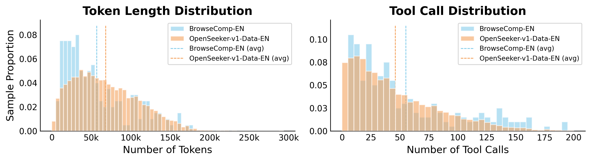
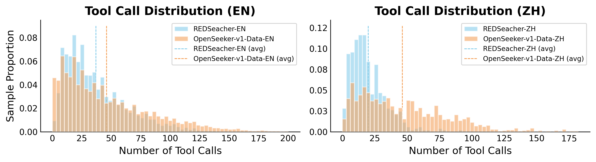

# Quick View

**Title**: OpenSeeker: Democratizing Frontier Search Agents by Fully Open-Sourcing Training Data
**Authors**: Yuwen Du, Rui Ye, Shuo Tang, Xinyu Zhu, Yijun Lu, Yuzhu Cai, Siheng Chen
**arXiv**: [2603.15594](https://arxiv.org/abs/2603.15594)
**Year**: 2026
**Institution**: Shanghai Jiao Tong University

# Question

How can academic researchers train high-performance search agents that rival industrial solutions, breaking the corporate monopoly on high-quality training data?

# Task

Build a fully open-source search agent training solution including:
1. High-difficulty question-answer (QA) pair synthesis method
2. High-quality search trajectory generation method
3. Fully open-sourced training data, model weights, and synthesis pipeline

# Challenge

1. **Data Monopoly**: Training high-performance search agents has been a "closed-door game" dominated by tech giants. High-quality training data serves as their primary moat. Companies like OpenAI, Google, and Alibaba release model weights but never their training data.

2. **Low Quality of Existing Open-Source Data**: Academic open-source datasets often suffer from poor quality and inadequate reasoning complexity. For example, MiroThinker trained on 147k samples still significantly underperforms commercial models.

3. **Insufficient QA Difficulty**: Simple QA pairs fail to force models into multi-turn tool calls and deep reasoning—they can be answered directly through parametric memory.

4. **Trajectory Noise Problem**: Raw web content contains excessive irrelevant noise that distracts teacher models from generating high-quality reasoning and actions.

# Insight

By "reverse-engineering" the web graph to construct questions (first identifying reasoning paths, then constructing questions that structurally mandate traversing those paths), and using an asymmetric strategy of "denoising during generation, training on raw noise" for trajectory synthesis, it's possible to surpass industrial-grade models with minimal high-fidelity data (11.7k samples) and simple SFT.

# Contribution

1. **Fact-grounded Scalable Controllable QA Synthesis**
   - **Approach**: Sample a seed node from web corpus; perform topological graph expansion to gather connected pages into a subgraph; extract entities to build an Entity Subgraph; generate initial questions conditioned on the subgraph structure; apply entity obfuscation to make questions harder; filter samples through dual-criteria verification (difficulty check + solvability check)
   - **Technical Advantage**:
     - Factual grounding: Anchored in real web topology rather than LLM generation, eliminating hallucination
     - Scalability: TB-scale web archives as inexhaustible data source
     - Controllability: Tune reasoning complexity via subgraph size

2. **Denoised Trajectory Synthesis**
   - **Approach**: Employ a retrospective summarization mechanism where, after each tool call, the raw tool response from the previous turn is compressed into a summary that replaces the original in the history window. The teacher model generates high-quality reasoning and actions based on this "clean" summarized context. However, during training, the student model must predict these expert-level actions conditioned on the original, raw, noisy history.
   - **Technical Advantage**: This asymmetric design forces the student to internalize denoising and information extraction capabilities, learning to "see through the noise" to identify essential signals.

3. **Fully Open-Sourced Dataset and Model**
   - **Approach**: Synthesize 10.3k English + 1.4k Chinese samples; perform SFT on Qwen3-30B-A3B
   - **Technical Advantage**: First search agent by a purely academic team to achieve SOTA while fully open-sourcing training data

# Experiments

## Core Contribution Impact (Ablation Studies)

### Main Results Comparison

| Model | Training | BrowseComp | BC-ZH | xbench | WideSearch |
|-------|----------|------------|-------|--------|------------|
| OpenSeeker-v1-30B-SFT | SFT | **29.5%** | **48.4%** | **74.0%** | **59.4%** |
| Tongyi DeepResearch | CPT+SFT+RL | 43.4% | 46.7% | 75.0% | - |
| WebSailor-V2-30B (SFT) | SFT | 24.4% | 28.3% | 61.7% | - |
| DeepDive-32B | SFT+RL | 15.3% | 29.7% | 51.8% | - |
| MiroThinker-32B-v0.1 | SFT | 10.6% | 13.8% | - | - |

**Key Findings**:
- With only SFT, OpenSeeker surpasses Tongyi DeepResearch (trained with CPT+SFT+RL) on BrowseComp-ZH (48.4% vs 46.7%)
- Data quality matters far more than quantity: 11.7k samples > 147k samples (MiroThinker)

### Data Difficulty Analysis

*Figure: Difficulty comparison between OpenSeeker-v1-Data-ZH and BrowseComp-ZH. OpenSeeker data averages 46.35 tool calls and 76.1k tokens, while BrowseComp-ZH averages only 26.98 calls and 15.1k tokens.*

*Figure: Difficulty comparison between OpenSeeker-v1-Data-EN and BrowseComp-EN. English data exhibits difficulty comparable to the benchmark.*

### Comparison with Concurrent Open-Source Works

*Figure: Tool call distribution comparison with REDSearcher. OpenSeeker data demonstrates significantly higher average tool calls (EN: 45.92 vs 36.91, ZH: 46.35 vs 20.02), proving the data is more challenging.*

### Comparison Under Comparable Data Volume

| Data | Samples | BrowseComp | xbench | WideSearch |
|------|---------|------------|--------|------------|
| WebSailor-V2-10k | 10k | 24.50% | 62.67% | 38.91% |
| WebSailor-V2-5k + WebLeaper-5k | 10k | 27.50% | 62.33% | 41.70% |
| **OpenSeeker-v1-Data** | **11.7k** | **29.50%** | **74.00%** | **59.40%** |

## Limitation

1. **Single Training Run**: Due to resource constraints, results are achieved in a single training run with default hyperparameters, without any heuristic data filtering or hyperparameter optimization

2. **English Data Not Yet Updated**: English data has not been updated to the latest QA standards, resulting in slightly lower difficulty compared to Chinese data

3. **Tool Set Limitation**: Currently supports only pure web search; has not integrated more diverse tools and data sources

4. **Context Window Constraints**: Requires balancing information retention with context window limitations
