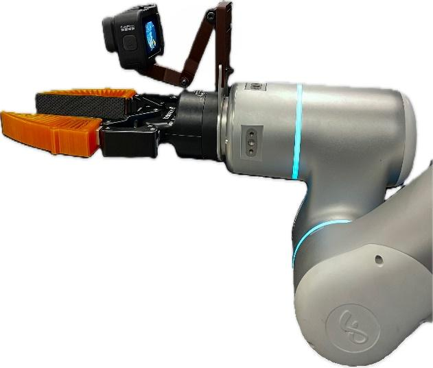

# Quick View

**Title**: FastUMI: A Scalable and Hardware-Independent Universal Manipulation Interface with Dataset  
**Authors**: Zhaxizhuoma, Kehui Liu, Chuyue Guan, Zhongjie Jia, Ziniu Wu, Xin Liu, Tianyu Wang, Shuai Liang, Pengan Chen, Pingrui Zhang, Haoming Song, Delin Qu, Dong Wang, Zhigang Wang, Nieqing Cao, Yan Ding, Bin Zhao, Xuelong Li  
**arXiv**: [2409.19499v2](https://arxiv.org/abs/2409.19499v2)  
**Year**: 2025  

# Question

How can we build a **scalable, hardware-independent, plug-and-play** sensor-augmented manipulation interface that remains robust under real-world occlusions (e.g., hinged operations), and produces high-quality demonstrations that directly support imitation learning?

# Task

Design FastUMI to collect FPV (first-person) video and end-effector trajectories with a handheld device, deploy a matching robot-mounted setup across diverse arms/grippers while preserving a consistent observation perspective, open-source a dataset of **10k+ demonstrations across 22 tasks**, and validate compatibility with common IL baselines (ACT, Diffusion Policy).

# Challenge

- **Hardware coupling**: the original UMI ties to specific components (e.g., WSG-50), making cross-platform deployment expensive (mechanical redesign, recalibration, code tuning).  
- **Complex / brittle localization**: GoPro VIO + SLAM pipelines can fail under prolonged occlusions; calibration and coordinate transforms are non-trivial.  
- **FPV learning difficulties**: wrist-mounted views hide most of the arm, geometry/layout varies across setups, and monocular fisheye lacks explicit depth—causing ACT/DP failures (invalid joints, unreachable targets, depth-sensitive errors).  

# Insight

Treat scalable data collection as an end-to-end system problem:  
**decouple and standardize the hardware + viewpoint alignment**, **replace fragile VIO/SLAM with a reliable off-the-shelf tracking module**, and provide a **data QA + algorithm adaptation ecosystem** tailored to FPV and heterogeneous grippers, so deployment becomes easy while learning remains effective.

  
*Figure (Paper Fig. 9): the 12 tasks used for policy evaluation (hinged, pick-place, pick-push, button-press).*  

# Contribution

1. **Hardware decoupling with consistent viewpoint transfer**
   - **Approach**:
     - Handheld: fisheye GoPro for wide-FOV observations; RealSense T265 for end-effector pose tracking; marker-based gripper aperture measurement.  
     - Robot-mounted: ISO-compatible flange plate, modular extension arms, and plug-in fingertip modules to align the robot camera viewpoint with the handheld viewpoint.  
   - **Technical Advantage**: removes dependence on specialized grippers/arms; enables direct transfer from human demonstrations to robot execution by maintaining a consistent observation perspective.

  
*Figure (Paper Fig. 1 sub-example): FastUMI deployed on a robot arm/gripper while preserving the camera-to-fingertip viewpoint.*  

2. **Plug-and-play software stack via T265 tracking (instead of GoPro VIO/SLAM)**
   - **Approach**:
     - Multi-ROS-node acquisition with unified timestamps; sub-sample to 20Hz; manage drift via reinitialization and loop closure using a visual reference region.  
     - GoPro remains for high-res FPV video, not for localization.  
   - **Technical Advantage**: reduces calibration and parameter tuning, improves robustness under partial occlusions, and speeds up deployment.

  
*Figure (Paper Fig. 11): APE over time; error peaks appear when features are occluded, and loop closure helps recover near the end.*  

3. **Data ecosystem: QA, representations, and formats for multiple algorithms**
   - **Approach**:
     - Enforce collection standards using tracking confidence (≥95% High) and smoothness thresholds; interpolate low-confidence poses.  
     - Provide absolute/relative TCP trajectories and joint trajectories (via IK), packaged in HDF5 (with scripts to convert to Zarr).  
   - **Technical Advantage**: makes the dataset directly usable for ACT/DP-like pipelines and reduces the “collected-but-unusable” risk.

4. **Algorithmic adaptations for FastUMI’s FPV data distribution**
   - **Approach**:
     - **Smooth-ACT**: add a GRU atop the transformer decoder for local temporal smoothing to reduce abrupt/invalid joint transitions.  
     - **PoseACT**: predict end-effector pose (optionally relative TCP) to improve platform transfer and numerical stability.  
     - **Depth-Enhanced DP**: add depth maps via Depth Anything V2 (offline + real-time at 20Hz on RTX 4090) to improve depth-critical tasks.  
     - **Dynamic error compensation**: compensate TCP shifts caused by non-parallel-jaw grippers during closing, then solve IK with corrected poses.  
   - **Technical Advantage**: directly addresses FPV failure modes (hidden arm, missing depth, gripper geometry differences) to improve real-world execution.

# Experiments

## Data quality (T265 vs MINI)

Using motion capture ground truth, the paper reports per-task pose errors and highlights a trade-off: T265 is strong when occlusion is low, while MINI is more stable across heavier occlusions (Appendix compares specs as well).

## Baselines (ACT vs DP on 12 tasks)

With 200 demos per task and 15 test trials per task (Table II), both ACT and DP achieve high success on many tasks, but:
- DP struggles on **depth-sensitive** tasks (e.g., Open Drawer / Pick Lid / Open Ricecooker).  
- ACT can produce **unseen extreme joint configurations** under FPV where the arm is mostly invisible.

## Core contribution impact (algorithm enhancements)

- **Depth-Enhanced DP (Table III)**:
  - Pick Lid: 53.33% → 80.00% (+26.67%)
  - Open Ricecooker: 20.00% → 93.33% (+73.33%)
- **ACT variants (Table IV)**: Smooth-ACT and PoseACT substantially improve success on representative tasks; relative TCP helps long/repetitive trajectories but may trade off vertical accuracy on some tasks.

# Limitation

- Limited sensing modalities (mostly vision; lacks force/tactile for delicate interactions).  
- Not yet adapted to more complex morphologies (e.g., mobile manipulators / whole-body control).  
- Wired data transfer limits portability; wireless + onboard/edge compute is future work.

