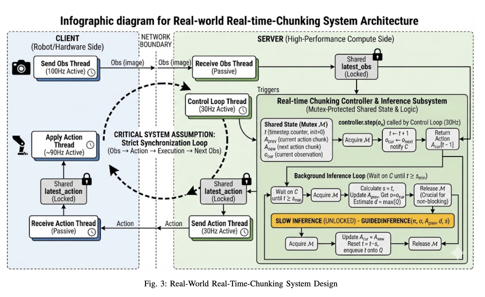
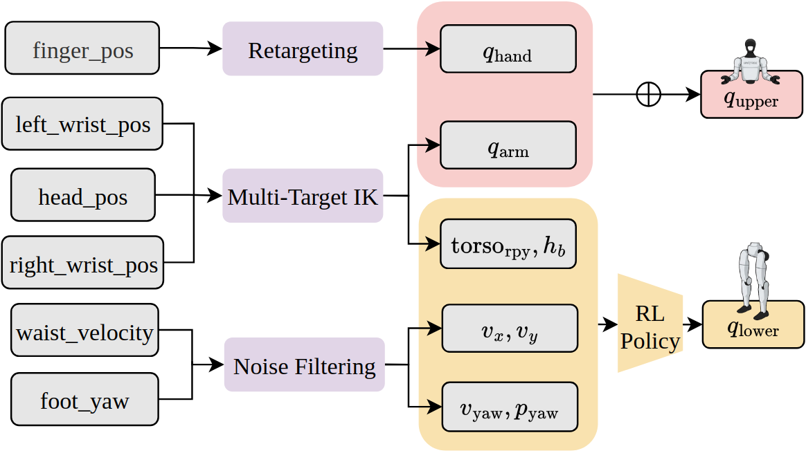
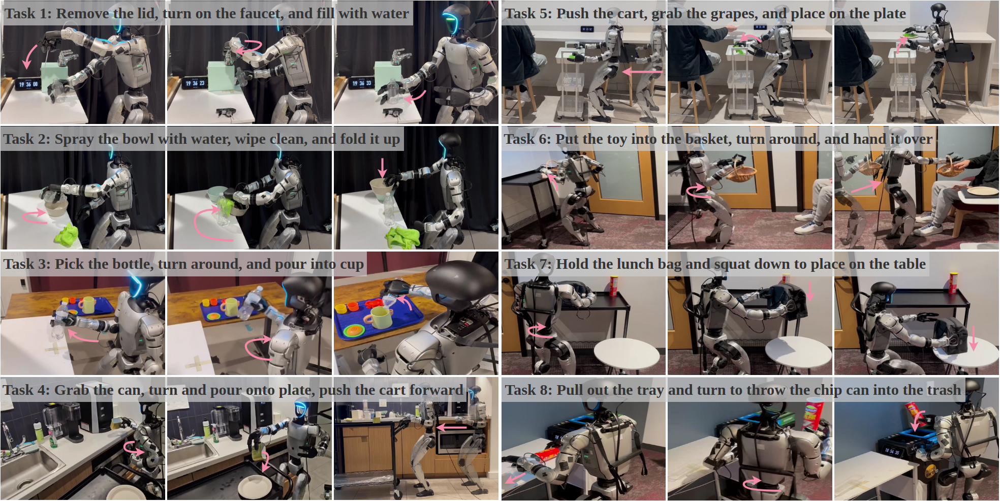

# Quick View

**Title**: Ψ0: An Open Foundation Model Towards Universal Humanoid Loco-Manipulation  
**Authors**: Songlin Wei, Hongyi Jing, Boqian Li, Zhenyu Zhao, Jiageng Mao, Zhenhao Ni, Sicheng He, Jie Liu, Xiawei Liu, Kaidi Kang, Sheng Zang, Weiduo Yuan, Marco Pavone, Di Huang, Yue Wang  
**arXiv**: [2603.12263v1](https://arxiv.org/abs/2603.12263v1)  
**Year**: 2026  

# Question

How can we distill motion priors and world knowledge from scalable **human egocentric manipulation videos** into robust **humanoid long-horizon loco-manipulation**, using only a small amount of expensive real humanoid data?

# Task

Given language instruction \(\\ell\) and observation \(o_t=(I_t, q_t)\) (head-camera image + proprioceptive state), predict a future action chunk \(a_{t:t+H}\) and execute it on a real humanoid (Unitree G1 + Dex3-1) across 8 long-horizon tasks (faucet turning, wiping, pushing a cart, pouring, squatting placement, pulling a chip-tray and throwing the can, etc.).

# Challenge

- **Embodiment gap**: humans vs humanoids differ in DoF, dynamics, and action frequencies; a single monolithic policy trained on heterogeneous action distributions is inherently suboptimal.  
- **Data efficiency**: real humanoid teleoperation is costly; scaling with noisy Internet videos or heterogeneous cross-robot mixtures often yields weaker controllable priors.  
- **Inference latency → jitter**: billion-scale VLAs introduce \(\sim 160ms\) latency, causing stop-think-execute pauses and discontinuous chunk transitions that harm long-horizon stability.  

# Insight

Avoid co-training one policy to model both human and humanoid action distributions. **Decouple learning objectives by stages**: learn task/visual-action semantics via VLM pre-training on high-quality egocentric human videos, then learn precise embodiment-specific joint control via a post-trained action expert on real humanoid data, and use training-time RTC to mitigate latency-induced jitter.

  
*Figure (Paper Fig. 1): Ψ0 performs diverse real-world pantry loco-manipulation skills, highlighting long-horizon, multi-skill execution.*  

# Contribution

1. **Triple-system humanoid VLA (System-2/1/0)**
   - **Approach**:
     - **System-2**: Qwen3-VL-2B-Instruct as the vision-language backbone producing VL features.  
     - **System-1**: a flow-based **MM-DiT** action expert (~500M) conditioned on VL features to predict joint-space action chunks \(a_{t:t+H}\).  
     - **System-0**: an RL tracking controller (AMO) maps 8-DoF lower-body commands into 15-DoF lower-body joints \(q_{lower}\).  
   - **Technical Advantage**: separates high-level semantics from embodiment-specific dynamics; MM-DiT’s joint attention and dual modulation fuse VL and action tokens more effectively than a naive DiT head.

2. **Staged training recipe: VLM pre-train → action expert post-train → small in-domain fine-tune**
   - **Approach**:
     - **Stage 1 (VLM pre-training)**: on EgoDex (~829h) + small Humanoid Everyday (31h), tokenize 48-DoF task-space actions with FAST and do **next-step action token prediction** (not full chunk autoregression) to learn representation and semantics efficiently.  
     - **Stage 2 (post-training)**: freeze the VLM and train the flow-based action expert in **joint space** using Humanoid Everyday (~3M frames).  
     - **Stage 3 (fine-tuning)**: per downstream real task, fine-tune the action expert using 80 teleop trajectories for 40k steps.  
   - **Technical Advantage**: leverages scalable high-quality human videos for priors while using limited high-quality humanoid data to learn controllable joint dynamics.

3. **Training-time Real-Time Chunking (RTC) + asynchronous deployment**
   - **Approach**:
     - During training, randomly mask the first \(d\\sim U(0, d_{max})\) tokens of the chunk and exclude them from loss; the model learns to generate future tokens conditioned on committed “clean” tokens, suppressing divergence at chunk boundaries.  
     - Deployment uses a client/server design: a 30Hz Control Loop maintains the obs→action→execution loop, while an asynchronous Inference Loop generates the next chunk when \(t\\ge s_{min}\) for seamless switching.  
   - **Technical Advantage**: reduces latency-induced jitter/collisions and improves long-horizon rollout stability without relying on unstable test-time guidance.

  
*Figure (Paper Fig. 9): Real-world RTC system design with asynchronous inference and mutex-protected shared state.*  

4. **Single-operator teleoperation tailored for loco-manipulation**
   - **Approach**: PICO headset + wrist trackers for multi-target IK (upper body), MANUS gloves for dexterous hand retargeting, and waist/foot trackers for high-level locomotion commands tracked by an RL controller.  
   - **Technical Advantage**: improves lower-body stability and preserves dexterity under a practical single-operator setup, producing higher-quality in-domain data.

  
*Figure (Paper Fig. 10, extracted subfigure): retargeting + multi-target IK + noise filtering feed a lower-body RL policy for stable whole-body control.*  

# Experiments

## Real-world benchmark (8 long-horizon tasks)

- **Protocol**: 10 rollouts per task; report both overall task success and skill/sub-task success; baselines are fine-tuned with matched obs/action representations and deployed with the same client code.  
- **Key outcome**: Ψ0 outperforms recent open-source baselines (π0.5, GR00T N1.6, InternVLA-M1, EgoVLA, H-RDT, DP, ACT, etc.) and reports **40%+** higher overall success than the second-best baseline, using roughly **800h human video + 30h real humanoid data**.

  
*Figure (Paper Fig. 6): the eight real-world task setups and their sub-steps.*  

## Core contribution impact (ablation)

On a dual-arm long-horizon task (Table I), the paper shows:
- VLM action pre-training on EgoDex is crucial vs using the vanilla pre-trained VLM only.  
- Post-training the joint-space action expert further improves success.  
- MM-DiT beats naive DiT due to better VL/action fusion.  
- RTC improves smoothness/stability and can reduce collisions, sometimes improving success rate.

# Limitation

- Scaling is limited by compute/time; larger human-video and real-robot datasets are left for future work.  
- Hardware payload constraints may cap the achievable manipulation behaviors.  
- The approach relies on training-time RTC because test-time guidance was found unstable in their setting, implying deployment assumptions matter.

